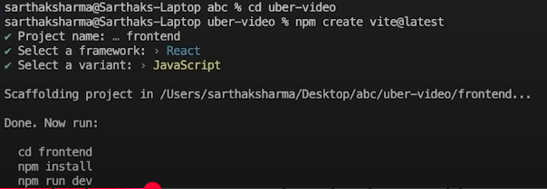
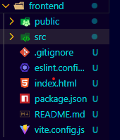
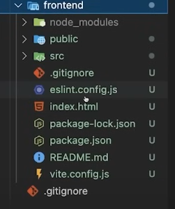

So lets start from the start suppose you are done writting the backend now you are going to write the backend

1. From the cmd of vs code cd to the `uber-video` and run npm create vite@latest
   ```cmd
   cd C:\Users\Hp\Documents\GitHub\uber-video>
   ```

npm create vite@latest

````
2. now it will ask you project name so set frontend this will create a folder named frontend under the uber-video folder
```cmd
Project name: frontend
select a framework: > React
select a variant: > JavaScript
````

3. now change your directory to the frontend

   ```cmd
    cd frontend
   ```

   till now these cmd are runs
   

   ```cmd

   ```

   

4. now runs two more cmd that are shown in the pic

   ```cmd
    npm install

    npm run dev
   ```

   npm install or npm i downloads the node packages that we have selected for our frontend
   
   npm rundev is for running for server or (to run this frontend folder)
   from the cmd you get the url just run it in your browser and you can see things now

   ```cmd
    C:\Users\Hp\Desktop\webProj>npm create vite@latest
    Need to install the following packages:
    create-vite@7.0.3
    Ok to proceed? (y) y


    > npx
    > create-vite

    │
    ◇  Project name:
    │  frontend
    │
    ◇  Select a framework:
    │  React
    │
    ◇  Select a variant:
    │  JavaScript
    │
    ◇  Scaffolding project in C:\Users\Hp\Desktop\webProj\frontend...
    │
    └  Done. Now run:

    cd frontend
    npm install
    npm run dev


    C:\Users\Hp\Desktop\webProj>cd frontend

    C:\Users\Hp\Desktop\webProj\frontend>npm i
    ⠙^CTerminate batch job (Y/N)? y

    C:\Users\Hp\Desktop\webProj\frontend>npm install

    added 152 packages, and audited 153 packages in 3m

    33 packages are looking for funding
    run `npm fund` for details

    found 0 vulnerabilities

    C:\Users\Hp\Desktop\webProj\frontend>npm run dev

    > frontend@0.0.0 dev
    > vite


    VITE v7.0.4  ready in 689 ms

    ➜  Local:   http://localhost:5173/
    ➜  Network: use --host to expose
    ➜  press h + enter to show help

   ```

   `note` ctrl+ c to terminate the server from running

## Src/

1. inside `src/app.jsx`, remove all the template code and write `rafce` and before that install `simple react snipest`

2. remove all the code from the `Src/index.css`

## Downloading tailwindcss

3. seacrh `tailwind.com`. then click on the `frameWork Guide` and go to the `vite` and just run the install tailwind cmd in your cmd
   1. after running the cmds you will get the file called tailwind.config.js, open this file (this is createed outside the src folder )
   2. now jis line pr content likha hua hain is ko replace kr ka tailwid.com main joo content line given hin woo likhi
   3. `note` above way of adding tailwind is `depricated` now

## Pages Folder

here make multiple files like

1. home.jsx
2. usrlogin.jsx
3. userSiginup.jsx

## Routing

routing is done with the help of a app.jsx file

`note ` before routing go to main.jsx and wrap the app with the browserRoute

```js
// src/main.jsx

import { StrictMode } from 'react'
import { createRoot } from 'react-dom/client'
import './index.css'
import App from './App.jsx'
import {BrowserRouter} from 'react-router-dom' // must do npm instal react-router-dom

createRoot(document.getElementById('root')).render(
  <StrictMode>
    <BrowserRouter>
    <App />
    </BrowserRouter>
  </StrictMode>,
)
// added lines are :
// import { BrowserRouter } from "react-router-dom";
// <BrowserRouter>
//   <App />
// </BrowserRouter>;
```
`note` run npm instal react-router-dom other then that you got the error 

and in the `Src/App.jsx`

```js
// src/App.jsx
import React from 'react'
import { Routes, Route } from 'react-router-dom' //this 
import Home from '../Pages/Home'  //importing home page from pages folder 

const App = () => {
  return (
<div>
  <Routes>                        
    <Route path="/" element={<Home />} /> //hitting the home file thorugh UrlPath /
  </Routes>
</div>
  )
//   total 4 lines here 
// import Home from '../Pages/Home' 
// <Routes>                        
//     <Route path="/" element={<Home />} /> 
//   </Routes>
}

export default App
```
initall code of home route 
```js 
// pages/home.jsx
import React from 'react'

const Home = () => {
  return (
    <div>Home</div>
  )
}

export default Home
```

# Pages Folder   src/pages  

1. html is written inside the return 
2. and js code is written before the return
3. main thing is how we travel from one page to another using link tag, if you want to write insde js inside the return then you to write it inside the opening tag just like our tailwindcss

```js 
// Src/pages/start.jsx
mport React from 'react'
import { Link } from 'react-router-dom'

const Start = () => {
  //at here we write js logic bcz it is before the return
  return (//inside the retun html is written 
    <div>
      <div className='bg-cover bg-center bg-[url(https://images.unsplash.com/photo-1619059558110-c45be64b73ae?q=80&w=2574&auto=format&fit=crop&ixlib=rb-4.0.3&ixid=M3wxMjA3fDB8MHxwaG90by1wYWdlfHx8fGVufDB8fHx8fA%3D%3D)] h-screen pt-8 flex justify-between flex-col w-full'>
        
        <div className='bg-white pb-8 py-4 px-4'>
          <h2 className='text-[30px] font-semibold'>Get Started with Uber</h2>
          <Link to='/login' className='flex items-center justify-center w-full bg-black text-white py-3 rounded-lg mt-5'>Continue</Link>  {/* we are connecting continue with the /login route for redirecting */}
        </div>
      </div>
    </div>
  )
}

export default Start
```
`note` here / route is for connected with the start.jsx page inside the app.jsx 
### Q how to perfoming routing in frontend 
using the link and the to the tag we perfom our routing 
```js
  import { Link } from 'react-router-dom'
  <Link to='/login'> Continue</Link>  
  // the to =  '/login' is perfoming routing 

```

## Two way binding || storing data inside the variable 

react variables are different then the nromall variables 
  they  had following things 
      1. name                             --->for holding the value 
      2. setname                          --->for setting the value 
      3. onchange function                ---> onthe spot value lyna ka lyia 
      4. preventDefault with onsubmit     ---> stops the dom reloadig 
   
```js
 const [ email, setEmail ] = useState('')// similar to the String a;
 const [ email, setEmail ] = useState('a@gmail')// similar to the String a = "a@gmail";
```

```js 
//src/pages/Userlogin.jsx

import React, { useState, useContext } from 'react' //importing reactvariable
import { Link } from 'react-router-dom'

const UserLogin = () => {
  const [ email, setEmail ] = useState('')  // these are the react variables
  const [ password, setPassword ] = useState('')
  const [ userData, setUserData ] = useState({})  //combine data into one variabe(object)/holder 

  const submitHandler = async (e) => {  // here prevent handler if it is not present then reload in minisec
    e.preventDefault();

    const userData = {  
      email: email,
      password: password
    }

    setEmail('') // after enetering when a person click submit this line again empty the input field in front end 
    setPassword('')
  }

  return (
    <div className='p-7 h-screen flex flex-col justify-between'>
      <div>
        

        <form onSubmit={(e) => { 
          submitHandler(e)
        }}>
          <h3 className='text-lg font-medium mb-2'>What's your email</h3>
          <input
            required
            value={email}     // similar to value = email email woo he joo opr return sy phela baniya hain
            onChange={(e) => { // onchange function 
              setEmail(e.target.value)
            }}
            className='bg-[#eeeeee] mb-7 rounded-lg px-4 py-2 border w-full text-lg placeholder:text-base'
            type="email"
            placeholder='email@example.com'
          />

          <h3 className='text-lg font-medium mb-2'>Enter Password</h3>

          <input
            className='bg-[#eeeeee] mb-7 rounded-lg px-4 py-2 border w-full text-lg placeholder:text-base'
            value={password}
            onChange={(e) => {
              setPassword(e.target.value)
            }}
            required type="password"
            placeholder='password'
          />

          <button
            className='bg-[#111] text-white font-semibold mb-3 rounded-lg px-4 py-2 w-full text-lg placeholder:text-base'
          >Login</button>

        </form>
        <p className='text-center'>New here? <Link to='/signup' className='text-blue-600'>Create new Account</Link></p>
      </div>
      <div>
        <Link
          to='/captain-login'
          className='bg-[#10b461] flex items-center justify-center text-white font-semibold mb-5 rounded-lg px-4 py-2 w-full text-lg placeholder:text-base'
        >Sign in as Captain</Link>
      </div>
    </div>
  )
}

export default UserLogin

```

#### summary of react variable working 
1. make empty react variable 
   ```js 
  const [ email, setEmail ] = useState('')
   ```
2. in the onsubmit fucntion of form prevent default behaviour 
  ```js
  const submitHandler = async (e) => {  // here prevent handler if it is not present then reload
    e.preventDefault();
    //necha wala code return ka andr hain
  <form onSubmit={(e) => { 
          submitHandler(e)
        }}>       
  ```
3. value = react variable and then set it in the onchange throgh setvariable
   ```js 
   <input
            required
            value={email}     // similar to value = email email woo he joo opr return sy phela baniya hain
            onChange={(e) => { // onchange function 
              setEmail(e.target.value)
            }}
            className='bg-[#eeeeee] mb-7 rounded-lg px-4 py-2 border w-full text-lg placeholder:text-base'
            type="email"
            placeholder='email@example.com'
          />
   ```
4. put all data into one single big react variable so that you can send all data together 
   ```js 
    const [ userData, setUserData ] = useState({})  //combine data into one variabe(object)/holder 
    const userData = {  
      email: email,
      password: password
    }

   ```
5. now again empty the variable so that empty input fields are shown in front end  
   ```js 
  setEmail('')
   ```

   ### Q why to prevent default behaviour 
1. By default, the browser refreshes the page to submit the form — that’s native HTML behavior.

2. So in React, if you don’t use event.preventDefault(), the page reloads right away.

3. This means any logs, state updates, or UI changes will disappear because the React app is wiped and restarted before they can be seen properly. 

### Q purpose of value={email} inside the form input tag
value={email}     this is similar to the name = email(without react), and then we setEmail(e.target.value) updates the email state with the new inputed field value.
means if combine all things together 
when user type in the filed each of it cames to the `value` and then setted inside the `email snippest` to get stored though the onchange function


#  Context Src/context
baiscally it is used to centeralize our data 
if was a big project then redexToolKit
1. wrap our app with the file which you have created inside the context folder yani jis tarah phela broswerdom ki bari kra tha same phir sy main ka andr jao app ko wrap kr doo 

```js 
// main.jsx
 <UserContext>
    <App />
  </UserContext>
```
`note` if you don't pass children then it will cause issues 
```js 
//src/context/usrcontext
import React, { createContext, useState } from 'react'

export const UserDataContext = createContext()


const UserContext = ({ children }) => {// this child 

    const [ user, setUser ] = useState({
        email: '',
        fullName: {
            firstName: '',
            lastName: ''
        }
    })

    return (
        <div>
            <UserDataContext.Provider value={{ user, setUser }}> {/* wrapping so that all child get provided data*/}
                {children} {/* this children is the App.jsx file */ }
            </UserDataContext.Provider>
        </div>
    )
}

export default UserContext

```
the code is bring all the data of the user at one place so next time when we need data about the use we can use usercontext

### Q why we need userContext
suppose you create the profile now you wants to display the info so you can eaily get it from the usercontext. and insde the usercontext this value cam from the login or siginup, basically `it reduces` the passing props manually